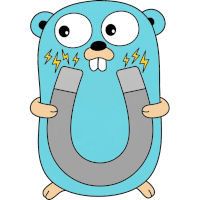

# Induction



Induction is a Go client for llama.cpp-compatible servers. It provides four
config-driven inference modes, OpenAI-compatible request and response types,
optional live terminal metrics, telemetry snapshots, model inspection, and
health checks.

## Documentation

For full documentation, visit: https://mwiater.github.io/induction/

## Prerequisites

### Go
Go, using the version declared in `go.mod` or newer.

### Hugging Face CLI
The modern Hugging Face CLI for model-manager operations:
`pip install -U huggingface_hub`.
Older `hf` releases without the `models` command use the Hub JSON API for
search and metadata; downloads still require `hf download`.

### GoReleaser

GoReleaser for application builds. Install it using the official package for your platform, or with Go:

```bash
go install github.com/goreleaser/goreleaser/v2@latest
```

  Ensure `goreleaser` is available on `PATH`.

### Terminal

Terminal: Depending on your terminal, you'll want to add/check for `truecolor` support. For Putty-based terminals:

Edit your `.bashrc` file:
`nano ~/.bashrc`

Add line:
`export COLORTERM=truecolor`

Save and exit:
`ctrl-x`, then `y`

Then, reload:
`source ~/.bashrc`

## Build

GoReleaser is the only supported and recommended application build workflow:

```bash
goreleaser release --snapshot --clean --skip=publish
```

Snapshot binaries and release artifacts are written beneath `dist/`.

## Configuration

The config-driven inference functions require `induction.yaml` in the current
working directory, normally the root of the user's project:

```yaml
server: http://localhost:9998
timeout: 20m
poll_interval: 2s
load_wait_interval: 1s
enableLiveMetricsOverlay: true
persistSnapshots: true
sidebarWidth: 32
log:
  path: induction.log
  console: true
  prefix: "app: "
  microseconds: true
```

`LoadConfig()` reads and validates the file once per process. The loaded config,
or the first error, is retained for subsequent calls. If the default file is
missing from the current working directory, config-driven inference returns an
error. The runnable examples log that error and exit.

## Model manager CLI

Model discovery and downloads use the modern Hugging Face CLI. Ensure `hf` is
on `PATH`. Existing `HF_TOKEN` authentication is inherited without being
printed.

Add a mapping to `induction.yaml` (relative paths become absolute at startup):

```yaml
ModelManager:
  SearchResults: 10
  PreferredProviders: [unsloth]
  ModelsPath: ./models
  PreferredQuantizations: [Q4_K_M, Q5_K_M]
  IncludePatterns: ["*.gguf"]
  ExcludePatterns: ["*mmproj*"]
  AvailableRAM: 64GiB       # optional; detected when omitted
  AvailableVRAM: 24GiB      # optional
```

Flags override `INDUCTION_MODELMANAGER_*` environment values, which override
YAML and defaults. Start the alternate-screen interface with
`induction model-manager [query]`. Enter searches, arrows or `j`/`k` navigate, `/`
edits the query, Escape goes back or cancels, and `q` or Ctrl-C exits. Selecting
a repository loads its exact artifacts; selecting an artifact shows its pinned
revision, URL, destination, size, and overwrite status. Press `y` to confirm
the download or `n` to return without changing local files. Running
`induction model-manager search` opens this interface unless `--json` is supplied.
Confirmed single-file and sharded downloads show byte-accurate progress against
each remote artifact size, followed by a separate byte-accurate SHA-256
validation bar.
The display calculates a smoothed transfer rate and approximate ETA for both
phases. It shows `calculating…` until enough byte and timing data is available.
When a server does not provide a size, the interface deliberately shows an
indeterminate transfer counter instead of a misleading percentage.

```bash
dist/induction_linux_amd64_v1/induction model-manager search "GLM-4.7-Flash-GGUF" --json
dist/induction_linux_amd64_v1/induction model-manager files unsloth/GLM-4.7-Flash-GGUF --json
dist/induction_linux_amd64_v1/induction model-manager download unsloth/GLM-4.7-Flash-GGUF GLM-4.7-Flash-Q4_K_M.gguf --yes
dist/induction_linux_amd64_v1/induction model-manager list --installed
dist/induction_linux_amd64_v1/induction model-manager verify unsloth/GLM-4.7-Flash-GGUF/GLM-4.7-Flash-Q4_K_M.gguf --json
dist/induction_linux_amd64_v1/induction model-manager update unsloth/GLM-4.7-Flash-GGUF/GLM-4.7-Flash-Q4_K_M.gguf --yes
dist/induction_linux_amd64_v1/induction model-manager remove unsloth/GLM-4.7-Flash-GGUF/GLM-4.7-Flash-Q4_K_M.gguf --yes
```

Expected noninteractive results are JSON for `search --json`, `files --json`,
`verify --json`, and successful downloads. `list --installed` prints one
repository/file path per line; a current update prints `CURRENT`, a successful
update prints its manifest, and a successful removal prints the model ID.

`details`, `verify`, `update`, and `remove` open an installed-model Bubble Tea
list when run without automation flags. Navigate with arrows or `j`/`k` and
press Enter to select. Verification runs in the interface; update and removal
show a separate `y`/`n` confirmation. Supplying `--json` to read-only commands
or `--yes` to destructive commands retains the noninteractive automation
behavior shown above.

Every model-manager command and meaningful interactive action is appended to
`induction-model-manager.log` in the working directory. Entries include UTC
timestamps, searches, selections, confirmations, cancellations, and operation
outcomes. Authentication tokens and environment credentials are never logged.

Downloads can be very large. Known insufficient disk space blocks a download;
RAM/VRAM fit labels are advisory, not runtime guarantees. Destructive
automation requires `--yes`, and paths are confined beneath `ModelsPath`.

Each artifact has an adjacent JSON provenance manifest. Schema 1 tracks one
exact file; schema 2 tracks a complete shard set. Both record an immutable,
revision-pinned URL and SHA-256. Updates stage and verify replacements on the
same filesystem before swapping them into place. A `.transaction` file marks
an interrupted update for recovery. An artifact without a completed manifest
is deliberately reported as incomplete/untracked and should be verified or
downloaded again.

Interactive chat commands use `sidebarWidth` as the total width of the
right-hand slot telemetry pane. The sidebar is open by default; press `Ctrl+1`
to hide or reveal it. Keyboard focus remains in the user input field between
turns so ordinary text can be entered without switching modes.

The four high-level inference functions automatically:

- Load `induction.yaml`.
- Create a configured client.
- Apply the configured timeout.
- Honor context cancellation.
- Enable live metrics when `enableLiveMetricsOverlay` is `true`.

Model selection belongs to each inference request rather than the process-wide
configuration. `ChatRequest.Model` is required by the four config-driven
inference functions, allowing each request to target a different model.

## Inference APIs

### `Infer`

Runs ordinary inference without snapshot telemetry and returns a typed,
OpenAI-compatible `InferenceResponse`:

```go
response, err := induction.Infer(ctx, &induction.ChatRequest{
	Model: "Your-Model-Name",
    Messages: []induction.Message{
        {Role: "system", Content: "You are a precise technical assistant."},
        {Role: "user", Content: "Explain atomic pointers."},
    },
})
if err != nil {
    log.Fatal(err)
}

choice := response.Choices[0]
fmt.Println(choice.Message.ReasoningContent)
fmt.Println(choice.Message.Content)
```

Message requests use `/v1/chat/completions`. Prompt requests use
`/v1/completions`:

```go
response, err := induction.Infer(ctx, &induction.ChatRequest{
	Model:  "Your-Model-Name",
    Prompt: "Explain atomic pointers.",
})
```

### `InferSnapshot`

Runs inference and returns a `ModelSnapshot` containing the interaction and
telemetry collected from `/props`, `/slots`, and `/metrics`:

```go
snapshot, err := induction.InferSnapshot(ctx, &induction.ChatRequest{
	Model: "Your-Model-Name",
    Messages: []induction.Message{
        {Role: "user", Content: "Explain atomic pointers."},
    },
})
if err != nil {
    log.Fatal(err)
}

for _, interaction := range snapshot.Interaction {
	fmt.Println(interaction.ReasoningContent)
	fmt.Println(interaction.Content)
	fmt.Println(interaction.Response) // complete raw response body
}
```

`ModelSnapshot` contains:

- `ModelID`
- `LoadTime`
- `CollectedAt`
- `Interaction`
- `Messages`
- `Props`
- `Slots`
- `Metrics`

Slots are refreshed while inference is active, with only the newest payload
retained. Final telemetry is fetched concurrently after inference. Failure of an individual telemetry
endpoint does not prevent the remaining fields from being populated.

### `InferStream`

Runs streaming inference and writes display-ready output to an `io.Writer`:

```go
err := induction.InferStream(ctx, &induction.ChatRequest{
	Model: "Your-Model-Name",
    Messages: []induction.Message{
        {Role: "user", Content: "Explain atomic pointers."},
    },
}, os.Stdout)
if err != nil {
    log.Fatal(err)
}
```

SSE framing and response metadata are consumed internally. Reasoning is
rendered before visible content as a block:

```text
<think>
model reasoning
</think>

visible assistant response
```

### `InferStreamChunks`

Runs streaming inference and delivers each complete typed
`InferenceStreamChunk` to a callback:

```go
err := induction.InferStreamChunks(ctx, &induction.ChatRequest{
	Model: "Your-Model-Name",
    Messages: []induction.Message{
        {Role: "user", Content: "Explain atomic pointers."},
    },
}, func(chunk induction.InferenceStreamChunk) error {
    for _, choice := range chunk.Choices {
        fmt.Print(choice.Delta.ReasoningContent)
        fmt.Print(choice.Delta.Content)
    }
    return nil
})
```

Returning an error from the callback stops the stream and returns that error to
the caller.

## Reasoning Content

Reasoning returned by the server as `reasoning_content` remains separate from
visible assistant content:

- `Infer`: `response.Choices[i].Message.ReasoningContent`
- `InferSnapshot`: each `snapshot.Interaction` item contains `ReasoningContent`
- `InferStreamChunks`: `chunk.Choices[i].Delta.ReasoningContent`
- `InferStream`: rendered as a `<think>...</think>` block

Each snapshot interaction retains the complete unmodified response body in its
`Response` field.

## Live Metrics Overlay

Set:

```yaml
enableLiveMetricsOverlay: true
```

to enable the same overlay for `Infer`, `InferSnapshot`, `InferStream`, and
`InferStreamChunks`.

While a model loads, the overlay displays `/models/sse` stage and progress
information. During inference it polls `/slots` and displays prompt tokens per
second, decoded tokens per second, and context utilization. It labels the active
model and whether inference is in the Prefill or Decode stage. During Prefill,
the decode rate is `n/a`; during Decode, the most recent non-zero decode rate is
retained between samples. Slot decoding can
begin before printable stream content appears because the server may first
produce reasoning, metadata, or buffered tokens.

Interactive chat sessions use a Bubble Tea console: conversation text scrolls
in the upper-left pane, yellow `/slots` details appear in a right-hand sidebar,
and the white-on-green metrics footer remains sticky across the full terminal
width. Unsupported or redirected terminals retain the plain text and PTerm
fallbacks. The overlay and its monitoring goroutines are stopped when inference
succeeds, fails, or is cancelled.

### Persistent chat sessions

The streaming console can save and resume named conversations. Use `Ctrl+S`
to save or rename the current conversation and `Ctrl+L` to browse saved
sessions. Use `Ctrl+M` to browse and load an available model without leaving
the chat. Loaded sessions restore both the transcript and model request
history. Sessions are stored as private, versioned JSON beneath `.sessions/`,
which is excluded from Git. Each chat session file also retains the per-turn
snapshot records, including model properties, slots, and metrics. Sessions are
explicitly marked `saved` or `unsaved`; unsaved sessions remain available on
disk for analysis but are omitted from the Load picker until named.

## Request Parameters

`ChatRequest` supports chat and completion payloads, including:

- Text or multimodal messages
- String or token-ID prompts
- Streaming, token limits, stop sequences, and seeds
- Temperature, top-p, top-k, min-p, and repetition penalties
- Mirostat, XTC, DRY, dynamic temperature, and sampler ordering
- Grammar and JSON-schema constraints
- Tools and tool choice
- Prompt caching, slot selection, token retention, and image data

Optional scalar fields use pointers so explicit zero and `false` values are not
lost to JSON `omitempty` behavior:

```go
temperature := 0.0
stream := false

req := &induction.ChatRequest{
	Model:       "Your-Model-Name",
    Temperature: &temperature,
    Stream:      &stream,
}
```

`Message.Content`, `Prompt`, `Stop`, schemas, and tool choice use `any` where
llama.cpp accepts more than one JSON shape.

## Examples

See the [complete examples guide](examples/README.md) for the Default, Stream,
Chat, and Snapshot modes, including MCP variants, configuration, usage commands,
and representative output.

## Client and Explicit-Endpoint APIs

Advanced callers can construct and reuse clients directly:

```go
client := induction.NewClient(ctx, endpoint,
    induction.WithHTTPClient(httpClient),
    induction.WithLogger(logger),
    induction.WithPollInterval(time.Second),
    induction.WithLoadWaitInterval(time.Second),
    induction.WithLiveMetricsOverlay(true),
)
```

Available client methods:

- `client.GenerateSnapshot(ctx, req)`
- `client.Chat(ctx, req)`
- `client.Complete(ctx, req)`
- `client.StreamChat(ctx, req, out)`
- `client.StreamComplete(ctx, req, out)`
- `client.ListModels()`
- `client.ListLoadedModels()`
- `client.CheckHealth()`

Explicit-endpoint convenience functions are also available:

- `induction.GenerateSnapshot(ctx, endpoint, req, options...)`
- `induction.Chat(ctx, endpoint, req, options...)`
- `induction.Complete(ctx, endpoint, req, options...)`
- `induction.StreamChat(ctx, endpoint, req, out, options...)`
- `induction.StreamComplete(ctx, endpoint, req, out, options...)`
- `induction.ListModels(endpoint, options...)`
- `induction.ListLoadedModels(endpoint, options...)`
- `induction.CheckHealth(endpoint, options...)`

The older `Chat` and `Complete` helpers return an `Interaction`, which includes
`Content`, `ReasoningContent`, and the complete raw `Response`. Their streaming
counterparts write extracted text to the supplied writer and return the
combined interaction.

## Model Listing

`ListModels` and `ListLoadedModels` send a table to the configured logger. The
table includes model status, context and batch sizes, cache configuration,
flash attention, common sampling values, and input/output modalities.

The model parser accepts both `{"data":[...]}` response envelopes and raw model
arrays. Metadata may appear as top-level fields or in nested `parameters` and
`args` maps.

## Console theme preview

Preview the terminal theme without connecting to a server:

```bash
induction ui theme
```

The command renders representative headers, icons, metrics, and footer styles,
then waits for a keypress. It is intended for an interactive terminal.

## Logging

The package sends diagnostic messages only to a supplied `Logger`. A standard
`log.Logger` satisfies the interface:

```go
client := induction.NewClient(ctx, endpoint,
    induction.WithLogger(log.Default()),
)
```

Without a logger, diagnostic output is discarded. The live metrics overlay is
the exception: when explicitly enabled, it writes to the terminal independently
of diagnostic logging.

## Health Checks

`CheckHealth` tries `/health` and then `/v1/health`, returning `nil` after the
first successful response:

```go
if err := induction.CheckHealth("http://localhost:9998"); err != nil {
    log.Fatal(err)
}
```

## Runtime Management

Runtime lifecycle operations use llama.cpp's router API and wait for the
server-reported terminal state:

```bash
induction runtime status
induction runtime status --json
induction runtime load MODEL
induction runtime unload MODEL
induction runtime switch MODEL
```

The Go API provides `GetRuntimeStatus`, `LoadModel`, `UnloadModel`, and
`SwitchModel`. Runtime state is server-authoritative; inference remains
request-scoped and does not implicitly switch or unload models.

Expected text output is a human-readable status or operation summary. The
`--json` form emits `RuntimeStatus` or `RuntimeOperation` JSON. Unknown models,
unsupported runtime endpoints, and state timeouts exit nonzero with an error on
stderr.

## Server Inspection

Read-only llama.cpp inspection is available from the CLI:

```bash
induction inspect server
induction inspect server --json
induction inspect model MODEL
induction inspect model MODEL --json
```

Inspection does not load, unload, or modify models. JSON is written to stdout
without ANSI formatting, while operational errors are written to stderr.
Successful server inspection includes `endpoint`, `role`, `healthy`, `models`,
and `loadedModels`; model inspection includes runtime arguments, capabilities,
and telemetry when the model is loaded.

## Testing

Run the full suite and race detector with:

```bash
go test ./...
go test -race ./...
```

Generate a coverage report with:

```bash
go test ./... -coverprofile=coverage.out -covermode=atomic
go tool cover -html=coverage.out
```
