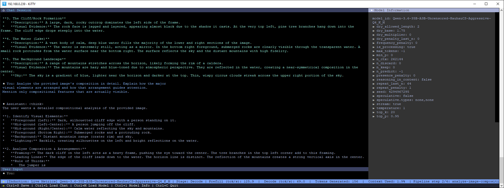

# Induction


Induction is a Go client for llama.cpp-compatible servers. It provides
config-driven chat inference, OpenAI-compatible request and response types,
live terminal metrics, per-turn telemetry snapshots, model inspection, health
checks, and MCP tool support.



## Documentation

Complete code reference can be fuond here: https://mwiater.github.io/induction/

## Configuration

Config-driven inference reads `induction.yaml` from the current working
directory:

```yaml
server: http://localhost:9998
timeout: 20m
poll_interval: 2s
load_wait_interval: 1s
enableLiveMetricsOverlay: true
sidebarWidth: 32
```

`ChatRequest.Model` selects the model for each request. Chat sessions are
stored as private JSON under `.sessions/`; each session contains its transcript
and the telemetry snapshots collected for completed turns.

## Chat inference

`InferChat` runs a multi-turn non-streaming session. `InferStreamChat` runs the
same session while writing generated content as it arrives:

```go
err := induction.InferStreamChat(ctx, &induction.ChatRequest{
    Model: "Your-Model-Name",
    Messages: []induction.Message{{Role: "system", Content: "Be helpful."}},
}, os.Stdin, os.Stdout)
```

Both functions retain the conversation and per-turn `ModelSnapshot` in the
session object. Snapshots include the interaction, complete message history,
model properties, slot samples, metrics, and request metadata. The lower-level
`Client.GenerateSnapshot` and `GenerateStreamingSnapshot` methods are
available when an application needs telemetry for a single turn.

Reasoning remains separate from visible content. Streaming output renders it
as a `<think>...</think>` block.

## MCP chat

`InferMCPChat` provides the same multi-turn chat experience with configured MCP
servers. Read-only tools run automatically; other tools may use an approval
callback through `InferMCPChatWithApproval`.

## Examples

The compiled binary supports text, multimodal, pipeline, MCP, application-tool,
and request-parameter inference. The following commands are runnable from the
repository root:

```bash
# Runs an interactive text chat. --model selects the server model.
dist/induction_linux_amd64_v1/induction --model "MiniCPM5-2B-Q8_0"

# Runs interactive image analysis. --model selects the model and --image adds
# the local image as input; the default image-analysis prompt is used.
dist/induction_linux_amd64_v1/induction --model "Qwen-3.6-35B-A3B-MTP-Coding-Q8_K_XL" --image data/fixtures/images/fixture.jpg

# Runs document question-answering. --document supplies a local PDF and
# --userPrompt asks what to do with it; --autosubmit sends that prompt
# immediately instead of waiting for interactive input.
dist/induction_linux_amd64_v1/induction --model "MiniCPM5-2B-Q8_0" --document data/fixtures/documents/fixture.pdf --userPrompt "Summarize this document." --autosubmit

# Runs interactive chat with request sampling overrides. --temperature controls
# randomness, --top-p and --top-k restrict token selection, --max-tokens limits
# output length, --repeat-penalty discourages repetition, and --seed makes the
# sampling sequence reproducible when supported by the server.
dist/induction_linux_amd64_v1/induction --model "MiniCPM5-2B-Q8_0" --temperature 0.85 --top-p 0.95 --top-k 20 --max-tokens 1024 --repeat-penalty 1.0 --seed 42

# Runs one unattended structured response. --systemPrompt controls the
# assistant's instructions, --userPrompt supplies the request, --responseFormat
# selects JSON-object output, --jsonSchema validates the requested shape,
# --autosubmit sends the prompt, and --autoexit exits after saving the response.
dist/induction_linux_amd64_v1/induction --model "MiniCPM5-2B-Q8_0" --userPrompt "Return a JSON greeting." --systemPrompt "Return only structured data." --responseFormat json_object --jsonSchema '{"type":"object","properties":{"greeting":{"type":"string"}},"required":["greeting"],"additionalProperties":false}' --autosubmit --autoexit

# Runs a multi-step pipeline. --pipeline loads the YAML workflow, including its
# models, prompts, and per-step options; it cannot be combined with direct
# inference flags such as --model or --userPrompt.
dist/induction_linux_amd64_v1/induction --pipeline pipelines/pipeline.prompt-optimization.yaml

# Runs unattended MCP-enabled inference. --model and --userPrompt select the
# request, while --autosubmit sends it immediately; configured MCP servers stay
# enabled because --nomcp is not present.
dist/induction_linux_amd64_v1/induction --model "Qwen-3.6-35B-A3B-MTP-Coding-Q8_K_XL" --userPrompt "What is the current local weather in Portland, OR?" --autosubmit

# Runs inference with local application tools and no configured MCP servers.
# --nomcp disables MCP for this invocation; --autosubmit submits the prompt.
dist/induction_linux_amd64_v1/induction --model "Agents-A1-MTP-Apex-I-Quality" --userPrompt "What is the current local weather in Portland, OR?" --autosubmit --nomcp

# Runs unattended inference and exits after the response is saved. --autoexit
# requires --autosubmit, which submits the non-empty --userPrompt immediately.
dist/induction_linux_amd64_v1/induction --model "MiniCPM5-2B-Q8_0" --userPrompt "Give me three concise deployment checks." --autosubmit --autoexit

# Runs inference using a non-default configuration file. --config selects the
# YAML file containing the server, timeout, and optional MCP settings.
dist/induction_linux_amd64_v1/induction --config induction.example.yaml --model "MiniCPM5-2B-Q8_0" --userPrompt "Check the configured server." --autosubmit

# Runs image inference with an explicit prompt. --image attaches the local
# image, --userPrompt describes the analysis, and --autosubmit submits it.
dist/induction_linux_amd64_v1/induction --model "Qwen-3.6-35B-A3B-MTP-Coding-Q8_K_XL" --image data/fixtures/images/fixture.jpg --userPrompt "Describe the image's composition." --autosubmit

# Runs document inference with an explicit system instruction. --document
# attaches the PDF, --systemPrompt sets assistant behavior, and --userPrompt
# supplies the document task; --autosubmit submits it immediately.
dist/induction_linux_amd64_v1/induction --model "MiniCPM5-2B-Q8_0" --document data/fixtures/documents/fixture.pdf --systemPrompt "Be concise and cite the document's sections." --userPrompt "List the main claims." --autosubmit

# Requests a JSON-schema response. --responseFormat selects json_schema and
# --jsonSchema supplies the inline object schema; --autosubmit and --autoexit
# make the request non-interactive and terminate after the saved response.
dist/induction_linux_amd64_v1/induction --model "MiniCPM5-2B-Q8_0" --userPrompt "Return the deployment status." --responseFormat json_schema --jsonSchema '{"type":"object","properties":{"status":{"type":"string"}},"required":["status"],"additionalProperties":false}' --autosubmit --autoexit

# Runs an application-tool request for live RAM information. --userPrompt asks
# for the measurement, --nomcp disables configured MCP servers, and
# --autosubmit sends the request immediately.
dist/induction_linux_amd64_v1/induction --model "Agents-A1-MTP-Apex-I-Quality" --userPrompt "Please check how much RAM is currently available on this machine and report it in both human-readable units and bytes. Use live system information rather than an estimate." --nomcp --autosubmit

# Application tools: date/time, RAM, disk, and tool chaining.
dist/induction_linux_amd64_v1/induction --model "Agents-A1-MTP-Apex-I-Quality" --userPrompt "Please check the current date and time, available RAM, and free disk space on the root filesystem. Use live system information." --nomcp --autosubmit

# Runs image and document workflows defined by YAML. --pipeline selects each
# workflow; their model and attachment settings come from the pipeline files.
dist/induction_linux_amd64_v1/induction --pipeline pipelines/pipeline.image-01.yaml
dist/induction_linux_amd64_v1/induction --pipeline pipelines/pipeline.document.yaml

# Runs unattended text inference with all sampling overrides and MCP disabled.
# --nomcp leaves local application tools available while preventing configured
# MCP tools from being used.
dist/induction_linux_amd64_v1/induction --model "MiniCPM5-2B-Q8_0" --userPrompt "Who is Claude Shannon?" --autosubmit --temperature 0.85 --top-p 0.95 --top-k 20 --max-tokens 1024 --repeat-penalty 1.0 --seed 42 --nomcp
```

All inference commands read `induction.yaml` from the current directory. Use
`--config PATH` to select another configuration file. MCP servers configured in
that YAML are automatically available; `--nomcp` disables them for one command
without changing the file. Image and document paths, plus pipeline YAML paths,
must be available at runtime.

## Model manager and inspection

Install the modern Hugging Face CLI for model-manager operations:

```bash
pip install -U huggingface_hub
```

After a model download completes, Induction automatically checks the exact
Hugging Face repository for `.eval_results` data. If none exists, it may cache
results from another repository only when the underlying model relationship is
confidently established. Exact-repository results are primary; external
results are secondary, and a repository has at most one active eval source.

Refresh evaluations for all installed repositories with:

```bash
induction models evals update
induction models evals update username/modelname
induction models evals update --json
```

The update is non-interactive and reports each processing step in the console.
For example:

```text
$ induction models evals update
[evals] scanning 2 installed repositories
[evals] repository 1/2: author/model-GGUF
[evals]   reading current eval state
[evals]   checking primary repository
[evals]   primary found (1 eval file)
[evals]   creating staging directory
[evals]   downloading eval file 1/1: .eval_results/results.yaml
[evals]   normalizing evaluation results
[evals]   activating eval bundle atomically
[evals]   complete: created_primary
[evals] repository 2/2: otherauthor/another-model-GGUF
[evals]   reading current eval state
[evals]   checking primary repository
[evals]   primary not found; discovering secondary candidates
[evals]   no eligible evaluation source found
[evals]   complete: not_found
author/model-GGUF                 PRIMARY   created_primary source=author/model-GGUF
otherauthor/another-model-GGUF    NONE      not_found

Scanned: 2  Updated: 1  Unchanged: 0  No eval: 1  Failed: 0
```

Cached data is stored under
`~/ai/models/<username>/<modelname>/evals/`, including the original source YAML,
provenance manifest, and normalized JSON.

The command-line tools include model discovery and downloads, plus read-only
server and model inspection. See the source under `internal/modelmanager` and
`internal/cli` for the complete command set.

## Dashboard metrics

Generate a rebuildable, server-free metrics projection from all valid saved and
unsaved sessions:

```bash
induction dashboard generate
```

The source is `.sessions/` and the outputs are
`data/dashboard/session_metrics.json` and the self-contained
`data/dashboard/dashboard.html`. Raw transcript, reasoning, response,
properties, metrics, and slot payloads are not copied; the session files remain
the source of truth.

Hydrate dashboard data across every installed model artifact with:

```bash
induction sessions hydrate
```

Hydration uses the model IDs and modality capabilities reported by the
server's `/v1/models` endpoint. It runs separate text, document, and
application-tool workloads for each reported model, plus MCP when servers are
configured and image inference for models that report image-input support.
Workloads run unattended, failures do not stop the remaining models, and the
dashboard is regenerated afterward. Pipelines and constrained-output requests
are not included.

## Command-line reference

The commands below are run from the repository or from an installed `induction`
binary. Commands that contact a server use the `server` and timeout settings in
`induction.yaml`; model commands also require the Hugging Face CLI and
model-manager configuration. Use `--help` after any command for its flags.

### Top-level commands

```bash
# Start the interactive inference workflow.
induction

# Show help for the CLI or for a specific command.
induction help
induction help runtime
induction help models

# List available top-level commands.
induction list

# List every command and subcommand with descriptions.
induction list commands

# Remove invalid persisted session data.
induction sessions clean

# Generate derived data artifacts.
induction dashboard
induction dashboard generate

# Inspect the configured server or one model.
induction server
induction server inspect
induction server inspect --json
induction models inspect "author/model-GGUF"
induction models inspect "author/model-GGUF" --json

# Replay a persisted chat session as an instantaneous transcript.
induction sessions inspect --session .sessions/<session-id>.json

# Inspect or change the runtime model state.
induction runtime
induction runtime status
induction runtime status --json
induction runtime load "author/model-GGUF"
induction runtime unload "author/model-GGUF"
induction runtime switch "author/model-GGUF"

# Preview the console UI theme.
induction ui
induction ui theme
```

`models inspect` requires a model identifier. The runtime `load`, `unload`, and
`switch` commands likewise require a model identifier. Their machine-readable
variants are available with `--json`; `server inspect` and `models inspect` also
accept that flag.

`sessions inspect` prints each completed user/assistant interaction from the
session, including saved reasoning content when available, without contacting
the inference server.

### Models

`models` is also available as the alias `model-manager`. Running the parent
command, or `search` without `--json`, starts the interactive workflow.

```bash
# Start model-manager, optionally with an initial search query.
induction models
induction models "reasoning 7B"

# Search Hugging Face interactively or return ranked JSON results.
induction models search "reasoning 7B"
induction models search "reasoning 7B" --json

# List repository files, using the configured file filters by default.
induction models files "author/model-GGUF"
induction models files "author/model-GGUF" --all --json

# Download a selected file. --yes is required for this operation.
induction models download "author/model-GGUF" "model-Q4_K_M.gguf" --yes
induction models download "author/model-GGUF" "model-Q4_K_M.gguf" --yes --revision REVISION_SHA

# List installed models or models currently loaded by the server.
induction models list --installed
induction models list --loaded
induction models list --installed --json

# Show details for an installed model (interactive or JSON).
induction models details
induction models details "author/model-GGUF"
induction models details "author/model-GGUF" --json

# Verify an installed model (interactive or JSON).
induction models verify
induction models verify "author/model-GGUF"
induction models verify "author/model-GGUF" --json

# Remove an installed model. --yes confirms the removal.
induction models remove
induction models remove "author/model-GGUF" --yes

# Update an installed model interactively, or update one model directly.
induction models update
induction models update "author/model-GGUF" --yes

# Check installed repositories for vision support and missing mmproj files.
# Missing projectors are confirmed interactively; --yes downloads all of them.
induction models mmproj
induction models mmproj --yes
induction models mmproj --json

# Refresh cached Hugging Face evaluation results.
induction models evals
induction models evals update
induction models evals update "author/model-GGUF"
induction models evals update --json
```

The models parent also accepts `--models-path`, `--search-results`, and
repeatable `--preferred-provider` options. For example:

```bash
induction models --models-path ~/ai/models --search-results 20 \
  --preferred-provider hf --preferred-provider modelscope search "vision 7B" --json
```

## Build and test

```bash
goreleaser release --snapshot --clean --skip=publish
```
