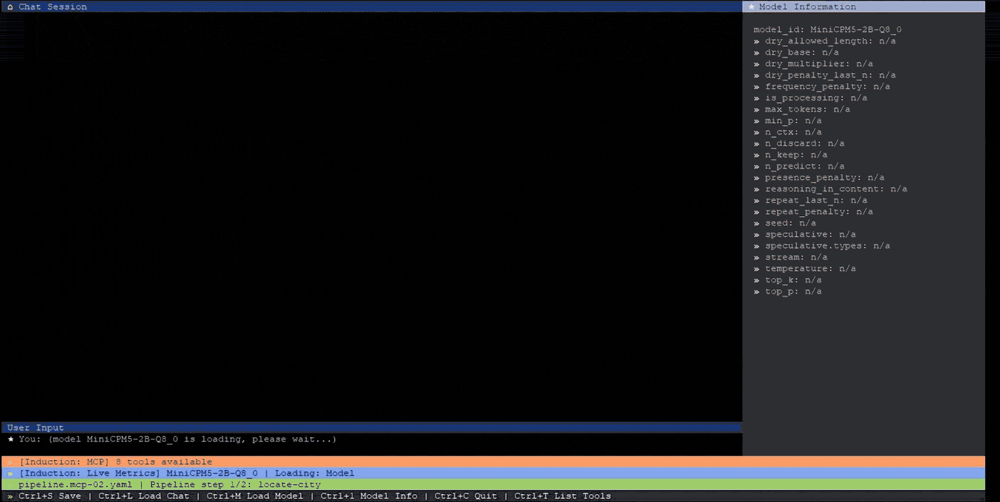
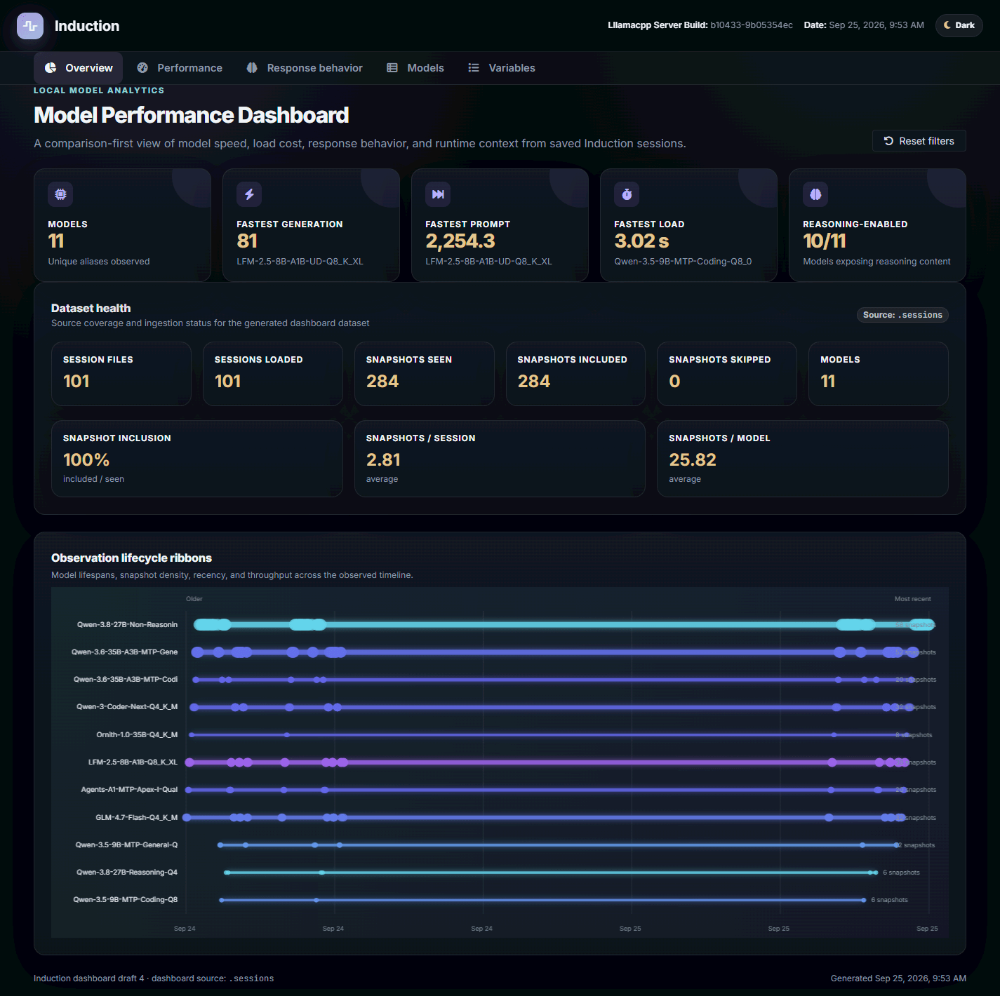
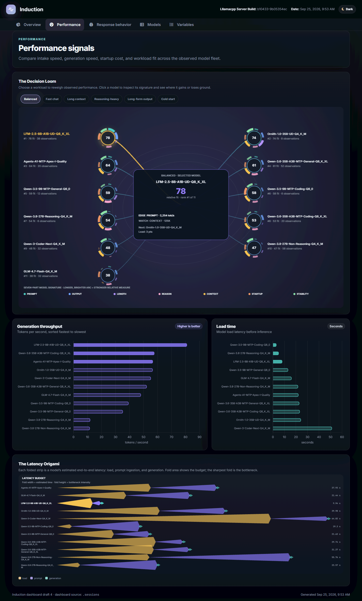
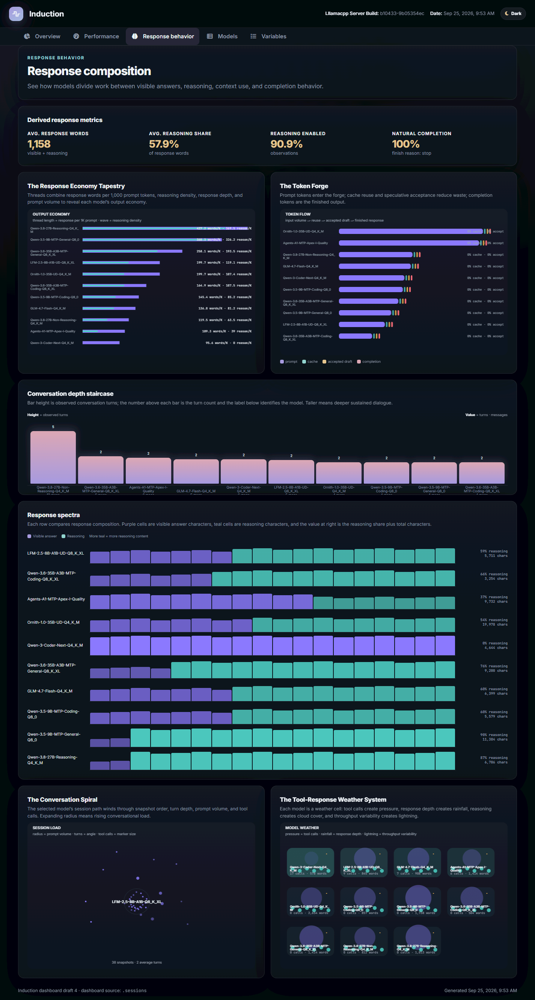
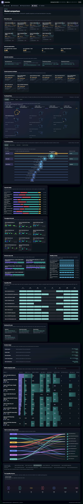

# Induction


Induction is a Go client for llama.cpp-compatible servers. It provides
config-driven chat inference, OpenAI-compatible request and response types,
live terminal metrics, per-turn telemetry snapshots, model inspection, health
checks, and MCP tool support.

Induction expects a reachable llama.cpp-compatible server with an OpenAI-style
`/v1` API. The server URL and runtime settings are configured in
`induction.yaml`; [`induction.example.yaml`](induction.example.yaml) is a
starting point.



## Dependencies

- **A running llama.cpp-compatible inference server started with the `--metrics`
  flag and using the expected OpenAI-style `/v1` API. Induction is designed to
  run on the same server as the llama.cpp installation so it can use the local
  model files, runtime controls, health endpoints, and metrics reliably.**
- `Go 1.26.4` or newer to build or run Induction from source.
- `GoReleaser` to produce the release artifacts with the documented build
  command.
- A `Linux AMD64` host. The current GoReleaser configuration builds and tests
  Linux AMD64 binaries only.
- Access to the model files and any image, PDF, or pipeline files used by an
  invocation. Relative paths are resolved from the current working directory
  or pipeline file as described below.
- `Docker` is optional. It can be used for the containerized workflow described
  in [DOCKER-BUILD-TESTING.md](DOCKER-BUILD-TESTING.md).

## Quick Start

### Build

Build and test the Linux AMD64 release artifacts in `dist/`:
```bash
goreleaser release --snapshot --clean --skip=publish
```

For local development, the CLI can also be run without building a release:

```bash
go run ./cmd/induction --help
```

### Use Docker (beta)

See: [DOCKER-BUILD-TESTING.md](DOCKER-BUILD-TESTING.md)

---

## Documentation

Complete code reference can be found here: https://mwiater.github.io/induction/

---

## Configuration

Config-driven inference reads `induction.yaml` from the current working
directory:

```yaml
server: http://localhost:9998
timeout: 20m
poll_interval: 2s
load_wait_interval: 1s
sidebarWidth: 32
```

The checked-in [`induction.example.yaml`](induction.example.yaml) also shows
MCP and model-manager settings. Copy it to `induction.yaml` and replace the
placeholder values before use. `MCPServerAllow` controls whether an MCP
server is exposed to inference; `--nomcp` disables all configured MCP servers
for one invocation.

`ChatRequest.Model` selects the model for each request. Chat sessions are
stored as private JSON under `.sessions/`; each session contains its transcript
and the telemetry snapshots collected for completed turns.

---

## Chat inference

`InferChat` runs a multi-turn non-streaming session. `InferStreamChat` runs the
same session while writing generated content as it arrives:

```go
err := induction.InferStreamChat(ctx, &induction.ChatRequest{
    Model: "Qwen-3.5-9B-MTP-General-Q8_0",
    Messages: []induction.Message{{Role: "system", Content: "Be helpful."}},
}, os.Stdin, os.Stdout)
```

Both functions retain the conversation and per-turn `ModelSnapshot` in the
session object. Snapshots include the interaction, complete message history,
model properties, slot samples, metrics, and request metadata. The lower-level
`Client.GenerateSnapshot` and `GenerateStreamingSnapshot` methods are
available when an application needs telemetry for a single turn.

Reasoning remains separate from visible content. Streaming output renders it
as a `<think>...</think>` block.

## MCP chat

`InferMCPChat` provides the same multi-turn chat experience with configured MCP
servers. Read-only tools run automatically; other tools may use an approval
callback through `InferMCPChatWithApproval`.

## Examples

The compiled binary supports text, multimodal, pipeline, MCP, application-tool,
and request-parameter inference. The following commands are runnable from the
repository root:

```bash
# Runs an interactive text chat. --model selects the server model.
dist/induction_linux_amd64_v1/induction --model "GLM-4.7-Flash-Q4_K_M"

# Runs interactive image analysis. --model selects the model and --image adds
# the local image as input; the default image-analysis prompt is used.
dist/induction_linux_amd64_v1/induction --model "Qwen-3.6-35B-A3B-MTP-General-Q8_K_XL" --image data/fixtures/images/fixture.jpg

# Runs document question-answering. --document supplies a local PDF and
# --userPrompt asks what to do with it; --autosubmit sends that prompt
# immediately instead of waiting for interactive input.
dist/induction_linux_amd64_v1/induction --model "Qwen-3.5-9B-MTP-General-Q8_0" --document data/fixtures/documents/fixture.pdf --userPrompt "Summarize this document." --autosubmit

# Runs document question-answering across every PDF directly inside a directory.
dist/induction_linux_amd64_v1/induction --model "Qwen-3.5-9B-MTP-General-Q8_0" --documents data/fixtures/documents --userPrompt "Summarize these documents." --autosubmit

# Runs interactive chat with request sampling overrides. --temperature controls
# randomness, --top-p and --top-k restrict token selection, --max-tokens limits
# output length, --repeat-penalty discourages repetition, and --seed makes the
# sampling sequence reproducible when supported by the server.
dist/induction_linux_amd64_v1/induction --model "LFM-2.5-8B-A1B-UD-Q8_K_XL" --temperature 0.85 --top-p 0.95 --top-k 20 --max-tokens 1024 --repeat-penalty 1.0 --seed 42

# Runs one unattended structured response. --systemPrompt controls the
# assistant's instructions, --userPrompt supplies the request, --responseFormat
# selects JSON-object output, --jsonSchema validates the requested shape,
# --autosubmit sends the prompt, and --autoexit exits after saving the response.
dist/induction_linux_amd64_v1/induction --model "Qwen-3-Coder-Next-Q4_K_M" --userPrompt "Return a JSON greeting." --systemPrompt "Return only structured data." --responseFormat json_object --jsonSchema '{"type":"object","properties":{"greeting":{"type":"string"}},"required":["greeting"],"additionalProperties":false}' --autosubmit --autoexit

# Runs a multi-step pipeline. --pipeline loads the YAML workflow, including its
# models, prompts, and per-step options; it cannot be combined with direct
# inference flags such as --model or --userPrompt.
dist/induction_linux_amd64_v1/induction --pipeline pipelines/pipeline.prompt-optimization-01.yaml

# Runs unattended MCP-enabled inference. --model and --userPrompt select the
# request, while --autosubmit sends it immediately; configured MCP servers stay
# enabled because --nomcp is not present.
dist/induction_linux_amd64_v1/induction --model "GLM-4.7-Flash-Q4_K_M" --userPrompt "What is the current local weather in Portland, OR?" --autosubmit

# Runs inference with local application tools and no configured MCP servers.
# --nomcp disables MCP for this invocation; --autosubmit submits the prompt.
dist/induction_linux_amd64_v1/induction --model "Agents-A1-MTP-Apex-I-Quality" --userPrompt "What is the current local weather in Portland, OR?" --autosubmit --nomcp

# Runs unattended inference and exits after the response is saved. --autoexit
# requires --autosubmit, which submits the non-empty --userPrompt immediately.
dist/induction_linux_amd64_v1/induction --model "LFM-2.5-8B-A1B-UD-Q8_K_XL" --userPrompt "Give me three concise deployment checks." --autosubmit --autoexit

# Runs inference using a non-default configuration file. --config selects the
# YAML file containing the server, timeout, and optional MCP settings.
dist/induction_linux_amd64_v1/induction --config induction.example.yaml --model "GLM-4.7-Flash-Q4_K_M" --userPrompt "Check the configured server." --autosubmit

# Runs image inference with an explicit prompt. --image attaches the local
# image, --userPrompt describes the analysis, and --autosubmit submits it.
dist/induction_linux_amd64_v1/induction --model "Qwen-3.6-35B-A3B-MTP-General-Q8_K_XL" --image data/fixtures/images/fixture.jpg --userPrompt "Describe the image's composition." --autosubmit

# Runs document inference with an explicit system instruction. --document
# attaches the PDF, --systemPrompt sets assistant behavior, and --userPrompt
# supplies the document task; --autosubmit submits it immediately.
dist/induction_linux_amd64_v1/induction --model "Qwen-3.5-9B-MTP-General-Q8_0" --document data/fixtures/documents/fixture.pdf --systemPrompt "Be concise and cite the document's sections." --userPrompt "List the main claims." --autosubmit

# Requests a JSON-schema response. --responseFormat selects json_schema and
# --jsonSchema supplies the inline object schema; --autosubmit and --autoexit
# make the request non-interactive and terminate after the saved response.
dist/induction_linux_amd64_v1/induction --model "Qwen-3-Coder-Next-Q4_K_M" --userPrompt "Return the deployment status." --responseFormat json_schema --jsonSchema '{"type":"object","properties":{"status":{"type":"string"}},"required":["status"],"additionalProperties":false}' --autosubmit --autoexit

# Runs an application-tool request for live RAM information. --userPrompt asks
# for the measurement, --nomcp disables configured MCP servers, and
# --autosubmit sends the request immediately.
dist/induction_linux_amd64_v1/induction --model "Agents-A1-MTP-Apex-I-Quality" --userPrompt "Please check how much RAM is currently available on this machine and report it in both human-readable units and bytes. Use live system information rather than an estimate." --nomcp --autosubmit

# Application tools: date/time, RAM, disk, and tool chaining.
dist/induction_linux_amd64_v1/induction --model "Agents-A1-MTP-Apex-I-Quality" --userPrompt "Please check the current date and time, available RAM, and free disk space on the root filesystem. Use live system information." --nomcp --autosubmit

# Runs image and document workflows defined by YAML. --pipeline selects each
# workflow; their model and attachment settings come from the pipeline files.
dist/induction_linux_amd64_v1/induction --pipeline pipelines/pipeline.image-01.yaml
dist/induction_linux_amd64_v1/induction --pipeline pipelines/pipeline.document-01.yaml

# Generates a pipeline from a complex prompt. --prompt and --prompt-file are
# mutually exclusive; --validate adds a read-only final validation step.
dist/induction_linux_amd64_v1/induction pipeline generate --model "Qwen-3.6-35B-A3B-MTP-Coding-Q8_K_XL" --prompt "Compare the two proposed rollout plans and recommend one with risks and mitigations." --output pipelines/generated/rollout-comparison.yaml --validate

# Hydrates telemetry sessions for every model reported by /v1/models and then
# regenerates the dashboard. Image workloads run only for models reporting
# image input; MCP workloads run only when MCP is configured.
dist/induction_linux_amd64_v1/induction sessions hydrate

# Runs unattended text inference with all sampling overrides and MCP disabled.
# --nomcp leaves local application tools available while preventing configured
# MCP tools from being used.
dist/induction_linux_amd64_v1/induction --model "GLM-4.7-Flash-Q4_K_M" --userPrompt "Who is Claude Shannon?" --autosubmit --temperature 0.85 --top-p 0.95 --top-k 20 --max-tokens 1024 --repeat-penalty 1.0 --seed 42 --nomcp
```

All inference commands read `induction.yaml` from the current directory. Use
`--config PATH` to select another configuration file. MCP servers configured in
that YAML are automatically available; `--nomcp` disables them for one command
without changing the file. Image and document paths, plus pipeline YAML paths,
must be available at runtime.

## Local model evaluations

Evaluations use the configuration file passed to `--eval-config` and write
normalized results under `data/evals/results/`:

```bash
induction eval --beta --eval-config inspect_evals.example.yaml --model "author/model-GGUF"
induction eval status --beta --eval-config inspect_evals.example.yaml --model "author/model-GGUF"
induction eval --beta --eval-config inspect_evals.example.yaml --allModels
```

The external Inspect AI dependencies must be installed separately. Evaluation
results are included in dashboard generation when they are valid and complete.

The checked-in [`inspect_evals.example.yaml`](inspect_evals.example.yaml)
defines the sample suite. Copy it and adjust the model, limits, or tasks for a
local evaluation run.

## Model manager and inspection

Install the modern Hugging Face CLI (`hf`) for model-manager operations:

```bash
pip install -U huggingface_hub
```

The command-line tools include model discovery and downloads, plus read-only
server and model inspection. See the source under `internal/modelmanager` and
`internal/cli` for the complete command set.

The model manager requires `ModelManager.ModelsPath` in the configuration. It
supports repository search, filtered file listings, GGUF downloads (including
sharded files), verification, updates, removal, runtime-loaded model listing,
and missing vision-projector (`mmproj`) checks. Use `--yes` on commands that
change local model state.

Preview text extraction from a local PDF without contacting the server:

```bash
induction pdf preview --file data/fixtures/documents/fixture.pdf
```

## Command-line reference

The commands below are run from the repository or from an installed `induction`
binary. Commands that contact a server use the `server` and timeout settings in
`induction.yaml`; model-manager operations require the Hugging Face CLI and
model-manager configuration. Use `--help` after any command for its flags.

### Top-level commands

```bash
# Start the interactive inference workflow.
induction

# Show help for the CLI or for a specific command.
induction help
induction help runtime
induction help models

# List available top-level commands.
induction list

# List every command and subcommand with descriptions.
induction list commands

# Remove invalid persisted session data.
induction sessions clean

# Generate derived data artifacts.
induction dashboard
induction dashboard generate

# Inspect the configured server or one model.
induction server
induction server inspect
induction server inspect --json
induction models inspect "author/model-GGUF" --beta
induction models inspect "author/model-GGUF" --json --beta

# Replay a persisted chat session as an instantaneous transcript.
induction sessions inspect --session .sessions/<session-id>.json

# Run representative workloads for every model reported by the server, then
# regenerate dashboard artifacts.
induction sessions hydrate

# Inspect or change the runtime model state.
induction runtime
induction runtime status
induction runtime status --json
induction runtime load "author/model-GGUF"
induction runtime unload "author/model-GGUF"
induction runtime switch "author/model-GGUF"

# Preview the console UI theme.
induction ui
induction ui theme
```

`models inspect` requires a model identifier. The runtime `load`, `unload`, and
`switch` commands likewise require a model identifier. Their machine-readable
variants are available with `--json`; `server inspect` and `models inspect` also
accept that flag.

`sessions inspect` prints each completed user/assistant interaction from the
session, including saved reasoning content when available, without contacting
the inference server.

`sessions hydrate` runs representative text, document, application-tool, MCP,
and supported image workloads for each model reported by `/v1/models`, then
regenerates the dashboard. Failed workloads are reported and do not prevent
other models from running.

The `models` command and all of its subcommands are beta features. Include
`--beta` on the `models` command you invoke to acknowledge that the feature is
still in development. The `eval` command is also beta and requires the same
acknowledgement. For example:

```bash
induction models --beta
induction models search "reasoning 7B" --beta
induction eval --beta --eval-config eval.yaml --model "author/model-GGUF"
induction eval status --beta --eval-config eval.yaml --model "author/model-GGUF"
```

`eval status` reads the saved result for the selected model and suite, then
prints each configured evaluation with its completed sample count. A result is
marked complete only when it matches the current evaluation definition and
sample limit; missing or partial evaluations are reported as missing.

### Models

`models` is also available as the alias `model-manager`. Running the parent
command, or `search` without `--json`, starts the interactive workflow.

```bash
# Start model-manager, optionally with an initial search query.
induction models --beta
induction models "reasoning 7B" --beta

# Search Hugging Face interactively or return ranked JSON results.
induction models search "reasoning 7B" --beta
induction models search "reasoning 7B" --json --beta

# List repository files, using the configured file filters by default.
induction models files "author/model-GGUF" --beta
induction models files "author/model-GGUF" --all --json --beta

# Download a selected file. --yes is required for this operation.
induction models download "author/model-GGUF" "model-Q4_K_M.gguf" --yes --beta
induction models download "author/model-GGUF" "model-Q4_K_M.gguf" --yes --revision REVISION_SHA --beta

# List installed models or models currently loaded by the server.
induction models list --installed --beta
induction models list --loaded --beta
induction models list --installed --json --beta

# Show details for an installed model (interactive or JSON).
induction models details --beta
induction models details "author/model-GGUF" --beta
induction models details "author/model-GGUF" --json --beta

# Verify an installed model (interactive or JSON).
induction models verify --beta
induction models verify "author/model-GGUF" --beta
induction models verify "author/model-GGUF" --json --beta

# Remove an installed model. --yes confirms the removal.
induction models remove --beta
induction models remove "author/model-GGUF" --yes --beta

# Update an installed model interactively, or update one model directly.
induction models update --beta
induction models update "author/model-GGUF" --yes --beta

# Check installed repositories for vision support and missing mmproj files.
# Missing projectors are confirmed interactively; --yes downloads all of them.
induction models mmproj --beta
induction models mmproj --yes --beta
induction models mmproj --json --beta

```

The models parent also accepts `--models-path`, `--search-results`, and
repeatable `--preferred-provider` options. For example:

```bash
induction models --models-path ~/ai/models --search-results 20 \
  --preferred-provider hf --preferred-provider modelscope search "vision 7B" --json --beta
```

`models files` applies the configured include/exclude and preferred
quantization filters by default; add `--all` to show every repository file.

### Pipeline files

Pipeline YAML files are available under [`pipelines/`](pipelines/). The
repository includes text, document, image, image-plus-text, MCP, and prompt
optimization examples, as well as a full structured-output example. Run any
pipeline with `induction --pipeline PATH`; attachment paths are resolved
relative to the pipeline file. [`pipelines/generated/README.md`](pipelines/generated/README.md)
shows a generated pipeline command using `pipeline generate`.

## Build and test

```bash
goreleaser release --snapshot --clean --skip=publish
```

The release configuration runs `gofmt`, `go vet`, the full test suite, and the
race-detector suite before producing the Linux AMD64 binary.

## Dashboard metrics

Generate a rebuildable, server-free metrics projection from all valid saved and
unsaved sessions:

```bash
induction dashboard generate
```

The source is `.sessions/` and the outputs are
`data/dashboard/session_metrics.json` and the self-contained
`data/dashboard/dashboard.html`. Raw transcript, reasoning, response,
properties, metrics, and slot payloads are not copied; the session files remain
the source of truth.

### Dashboard examples

Running `induction dashboard generate` creates the self-contained static HTML
file `data/dashboard/dashboard.html` and the metrics projection
`data/dashboard/session_metrics.json`.

#### Dashboard: Overview


#### Dashboard: Performance


#### Dashboard: Response Behavior


#### Dashboard: Models

