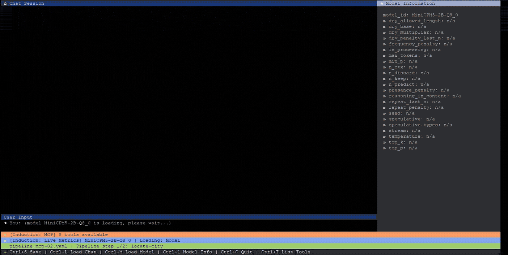

# Induction

Induction is a Go client for llama.cpp-compatible servers. It provides
config-driven chat inference, multimodal requests, structured output,
pipelines, telemetry, model inspection, health checks, and MCP tool support.

Induction expects a reachable llama.cpp-compatible server with an OpenAI-style
`/v1` API. Configure the server and runtime settings in `induction.yaml`;
[`induction.example.yaml`](induction.example.yaml) is a starting point.



## Dependencies

- A running llama.cpp-compatible inference server started with the `--metrics`
  flag and using the expected OpenAI-style `/v1` API.
- Go 1.26.4 or newer to build or run Induction from source.
- GoReleaser to produce release artifacts.
- A Linux AMD64 host for the current release configuration.
- Access to the model and any image, PDF, or pipeline files used by an
  invocation.
- Docker for the easiest quick start: [DOCKER-QUICKSTART.md](DOCKER-QUICKSTART.md).

## Quick Start

### Use Docker — easiest

See [DOCKER-QUICKSTART.md](DOCKER-QUICKSTART.md).

### Build

Build and test the Linux AMD64 release artifact:

```bash
goreleaser release --snapshot --clean --skip=publish
```

For local development:

```bash
go run ./cmd/induction --help
```

## Documentation

The complete code reference is available at
<https://mwiater.github.io/induction/>.

Focused guides:

- [Inference](docs/INFERENCE.md)
- [MCP and application tools](docs/MCP.md)
- [Pipelines](docs/PIPELINES.md)
- [Model manager and inspection](docs/MODELS/MODEL-MANAGER.md)
- [Evaluations](docs/EVALUATIONS.md)
- [CLI reference](docs/CLI-REFERENCE.md)
- [Dashboard metrics](docs/DASHBOARD.md)
- [Development](docs/DEVELOPMENT.md)

## Configuration

Config-driven inference reads `induction.yaml` from the current working
directory:

```yaml
server: your-llamacpp-inference-endpoint
timeout: 20m
pollInterval: 2s
loadWaitInterval: 1s
sidebarWidth: 64
log:
  prefix: "induction: "
  microseconds: true
  truncateOnRun: true
mcpServers:
  - mcpServerAllow: true
    mcpServerName: your-mcp-server-name
    mcpServerURL: your-mcp-server-endpoint
# Optional: required only for model-manager commands.
# modelManager:
#   searchResults: 20
#   preferredProviders:
#     - unsloth
#   modelsPath: /path/to/saved/models
#   huggingFaceToken: {optional-hugging-face-token}
resourceBudget:
  reasoning:
    cutoff:
      enabled: true
      maxTokens: 4096
      maxSeconds: 30
      maxContextPercent: 75
```

The checked-in [`induction.example.yaml`](induction.example.yaml) contains the
available configuration fields. Copy it to `induction.yaml`, uncomment the
optional sections you need, and replace placeholder values before use:

| Field | Meaning |
| --- | --- |
| `server` | llama.cpp-compatible inference endpoint. |
| `timeout` | Maximum duration for a request or operation. |
| `pollInterval` | Interval used while polling server state. |
| `loadWaitInterval` | Delay between model-load readiness checks. |
| `sidebarWidth` | Width of the terminal sidebar. |
| `log.prefix` | Prefix written before each log message. |
| `log.microseconds` | Include microseconds in log timestamps. |
| `log.truncateOnRun` | Truncate `induction.log` once when the application starts. |
| `mcpServers[].mcpServerAllow` | Enable that MCP server for inference. |
| `mcpServers[].mcpServerName` | Display name used to identify the MCP server. |
| `mcpServers[].mcpServerURL` | MCP server endpoint. |
| `modelManager.searchResults` | Number of model search results to return. |
| `modelManager.preferredProviders` | Provider order used by model searches and downloads. |
| `modelManager.modelsPath` | Local directory containing downloaded models. |
| `modelManager.huggingFaceToken` | Optional Hugging Face access token for model operations. |
| `resourceBudget.reasoning.cutoff.enabled` | Enable global reasoning cutoff. |
| `resourceBudget.reasoning.cutoff.maxTokens` | Maximum reasoning tokens observed through live slot metrics. |
| `resourceBudget.reasoning.cutoff.maxSeconds` | Maximum elapsed time after reasoning begins. |
| `resourceBudget.reasoning.cutoff.maxContextPercent` | Maximum active context-window utilization. |

At least one threshold is required when `enabled` is `true`; the other
thresholds are optional and may be omitted or left blank. The first configured
threshold reached ends reasoning.

`--nomcp` disables all configured MCP servers for one invocation. Chat sessions
are stored as private JSON under `.sessions/`, and application diagnostics are
written to `induction.log`.


## Common commands

Run these from the repository root or with an installed `induction` binary:

```bash
# Interactive text chat.
induction --model "MODEL"

# Unattended document question-answering.
induction --model "MODEL" --document PATH \
  --userPrompt "Summarize this document." --autosubmit

# Structured output.
induction --model "MODEL" --userPrompt "Return a JSON greeting." \
  --responseFormat json_object --autosubmit --autoexit

# A reusable pipeline.
induction --pipeline pipelines/pipeline.prompt-optimization-01.yaml

# Knowledge graph pipeline.
induction --pipeline pipelines/pipeline.emergent-knowledge-graph.yaml

# Inspect the configured server.
induction server inspect --json

# Generate the dashboard projection.
induction dashboard generate
```

Use `induction help` or see the [CLI reference](docs/CLI-REFERENCE.md) for
the complete command set.

The same examples can run from the Docker image. Build the image first with
`docker build -t induction .`, then run these commands from the repository
root. The configuration mount is required; the repository mount makes local
documents available inside the container as `/workspace`.

```bash
# Interactive text chat.
docker run -it --rm \
  -v "$PWD/induction.yaml:/app/induction.yaml:ro" \
  induction --model "MODEL"

# Unattended document question-answering.
docker run -it --rm \
  -v "$PWD/induction.yaml:/app/induction.yaml:ro" \
  -v "$PWD:/workspace:ro" \
  induction --model "MODEL" --document "/workspace/PATH" \
  --userPrompt "Summarize this document." --autosubmit

# Structured output.
docker run -it --rm \
  -v "$PWD/induction.yaml:/app/induction.yaml:ro" \
  induction --model "MODEL" --userPrompt "Return a JSON greeting." \
  --responseFormat json_object --autosubmit --autoexit

# A reusable pipeline.
docker run -it --rm \
  -v "$PWD/induction.yaml:/app/induction.yaml:ro" \
  induction --pipeline pipelines/pipeline.prompt-optimization-01.yaml

# Knowledge graph pipeline.
docker run -it --rm \
  -v "$PWD/induction.yaml:/app/induction.yaml:ro" \
  induction --pipeline pipelines/pipeline.emergent-knowledge-graph.yaml

# Inspect the configured server.
docker run -it --rm \
  -v "$PWD/induction.yaml:/app/induction.yaml:ro" \
  induction server inspect --json

# Generate the dashboard projection.
docker run -it --rm \
  -v "$PWD/induction.yaml:/app/induction.yaml:ro" \
  -v "$PWD/.sessions:/app/.sessions:ro" \
  -v "$PWD/data:/app/data" \
  induction dashboard generate
```

Container output and logs are ephemeral unless you mount a host directory. See
[DOCKER-QUICKSTART.md](DOCKER-QUICKSTART.md) for persistent log and asset
mounts.

## Decision pipelines

Jev-style decision inference scores the next token over a bounded set of
model-facing candidates. Induction validates each candidate as exactly one
token for the selected model, normalizes scores only across the configured
candidate set, and constructs the `DecisionResult`. A candidate's mapped
value is its semantic meaning for pipeline conditions.

```text
prompt / image / document
          ↓
      model prefill
          ↓
 next-token log probabilities
          ↓
 configured candidate mask
          ↓
 candidate-only softmax
          ↓
 DecisionResult
          ↓
 optional pipeline condition
```

These probabilities are conditioned on the configured candidates, not the
full vocabulary. `confidence` is the winning probability; `margin` is the
difference between the highest and second-highest probabilities. Candidate
rows are sorted by token, and exact ties select the first token in that order.
Text, image, and extracted document context use the same decision mechanism.

Use `decision:` in new pipelines. Existing `classification:` blocks remain
supported as a legacy alias. A `when:` condition can gate a later step on the
semantic value from an earlier decision step and optionally set
`minConfidence` and `minMargin` in `[0,1]`; all checks must pass. A failed
condition records a skipped transcript entry and makes no inference request
for that step. For an uncertainty review path, map a candidate to `uncertain`
and gate a generative review on `equals: uncertain`.

Decision steps should use a Jev decision model. The routing example uses the
server model ID `JEV5K-v0.3-4B-Q8_0`, backed by the JevK5 v0.3 4B Q8_0 GGUF
from [the model card](https://huggingface.co/alibiserikbay/JevK5-GGUF). Your
llama.cpp configuration must expose that model ID; later generative review
steps can use a separate general-purpose model.

```yaml
- name: relevance-gate
  model: JEV5K-v0.3-4B-Q8_0
  userPrompt: |
    Classify the supplied material. Return only A or B.
    A = relevant
    B = irrelevant
  decision:
    candidates:
      A: relevant
      B: irrelevant
    topLogprobs: 20
- name: analyze-relevant
  model: Qwen-3.5-9B-MTP-General-Q8_0
  when:
    decision: relevance-gate
    equals: relevant
    minConfidence: 0.8
  userPrompt: Analyze the supplied material.
```

`topLogprobs` defaults to `20` and must be at least the candidate count. A
missing configured candidate score fails the step. Candidate probabilities
are renormalized over that configured set only. The application-authored
result retains candidate identity, value, raw log probability, and normalized
probability:

```json
{
  "type": "decision",
  "selectedCandidate": "A",
  "selectedValue": "relevant",
  "confidence": 0.91,
  "margin": 0.82,
  "candidates": [
    {"candidate": "A", "value": "relevant", "logprob": -0.10, "probability": 0.91},
    {"candidate": "B", "value": "irrelevant", "logprob": -2.41, "probability": 0.09}
  ]
}
```

These numbers illustrate the shape and are not guaranteed model output. See
the [pipeline authoring guide](docs/PIPELINES.md#decision-steps-and-conditional-routing)
for validation rules, the complete result contract, and server requirements.

The compatible llama.cpp server must support OpenAI-style chat completion
log probabilities. Induction requests one output token with log probabilities;
no additional logits startup flag is required for this path. Image decisions
need a vision-capable model and its multimodal projector.

Run the checked-in example with:

```bash
induction --pipeline pipelines/pipeline.decision-routing-01.yaml
```
