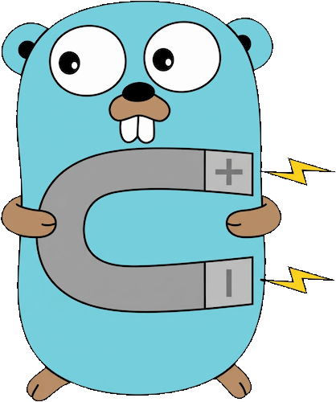

# Induction



Induction is a Go client for llama.cpp-compatible servers. It provides
config-driven chat inference, multimodal requests, structured output,
pipelines, telemetry, model inspection, health checks, and MCP tool support.

Induction expects a reachable llama.cpp-compatible server with an OpenAI-style
`/v1` API. Configure the server and runtime settings in `induction.yaml`;
[`induction.example.yaml`](induction.example.yaml) is a starting point.


## Dependencies

- A running llama.cpp-compatible inference server started with the `--metrics`
  flag and using the expected OpenAI-style `/v1` API.
- Go 1.26.4 or newer to build or run Induction from source.
- GoReleaser to produce release artifacts.
- A Linux AMD64 host for the current release configuration.
- Access to the model and any image, PDF, or pipeline files used by an
  invocation.
- Docker for the easiest quick start: [DOCKER-QUICKSTART.md](DOCKER-QUICKSTART.md).

## Quick Start

### Use Docker — easiest

See [DOCKER-QUICKSTART.md](DOCKER-QUICKSTART.md).

### Build

Build and test the Linux AMD64 release artifact:

```bash
goreleaser release --snapshot --clean --skip=publish
```

For local development:

```bash
go run ./cmd/induction --help
```

## Documentation

The complete code reference is available at
<https://mwiater.github.io/induction/>.

Focused guides:

- [Inference](docs/INFERENCE.md)
- [MCP and application tools](docs/MCP.md)
- [Pipelines](PIPELINES.md)
- [Model manager and inspection](docs/MODELS/MODEL-MANAGER.md)
- [Evaluations](docs/EVALUATIONS.md)
- [CLI reference](docs/CLI-REFERENCE.md)
- [Dashboard metrics](docs/DASHBOARD.md)
- [Development](docs/DEVELOPMENT.md)

## Configuration

Config-driven inference reads `induction.yaml` from the current working
directory:

```yaml
server: your-llamacpp-inference-endpoint
timeout: 20m
poll_interval: 2s
load_wait_interval: 1s
sidebarWidth: 64
log:
  prefix: "induction: "
  microseconds: true
  truncateOnRun: true
MCPServers:
  - MCPServerAllow: true
    MCPServerName: your-mcp-server-name
    MCPServerURL: your-mcp-server-endpoint
ModelManager:
  SearchResults: 20
  PreferredProviders:
    - unsloth
  ModelsPath: /path/to/saved/models
  HuggingFaceToken: {optional-hugging-face-token}
```

The checked-in [`induction.example.yaml`](induction.example.yaml) contains this
complete field set. Copy it to `induction.yaml` and replace the placeholder
values before use:

| Field | Meaning |
| --- | --- |
| `server` | llama.cpp-compatible inference endpoint. |
| `timeout` | Maximum duration for a request or operation. |
| `poll_interval` | Interval used while polling server state. |
| `load_wait_interval` | Delay between model-load readiness checks. |
| `sidebarWidth` | Width of the terminal sidebar. |
| `log.prefix` | Prefix written before each log message. |
| `log.microseconds` | Include microseconds in log timestamps. |
| `log.truncateOnRun` | Truncate `induction.log` once when the application starts. |
| `MCPServers[].MCPServerAllow` | Enable that MCP server for inference. |
| `MCPServers[].MCPServerName` | Display name used to identify the MCP server. |
| `MCPServers[].MCPServerURL` | MCP server endpoint. |
| `ModelManager.SearchResults` | Number of model search results to return. |
| `ModelManager.PreferredProviders` | Provider order used by model searches and downloads. |
| `ModelManager.ModelsPath` | Local directory containing downloaded models. |
| `ModelManager.HuggingFaceToken` | Optional Hugging Face access token for model operations. |

`--nomcp` disables all configured MCP servers for one invocation. Chat sessions
are stored as private JSON under `.sessions/`, and application diagnostics are
written to `induction.log`.


## Common commands

Run these from the repository root or with an installed `induction` binary:

```bash
# Interactive text chat.
induction --model "MODEL"

# Unattended document question-answering.
induction --model "MODEL" --document PATH \
  --userPrompt "Summarize this document." --autosubmit

# Structured output.
induction --model "MODEL" --userPrompt "Return a JSON greeting." \
  --responseFormat json_object --autosubmit --autoexit

# A reusable pipeline.
induction --pipeline pipelines/pipeline.prompt-optimization-01.yaml

# Knowledge graph pipeline.
induction --pipeline pipelines/pipeline.emergent-knowledge-graph.yaml

# Inspect the configured server.
induction server inspect --json

# Generate the dashboard projection.
induction dashboard generate
```

Use `induction help` or see the [CLI reference](docs/CLI-REFERENCE.md) for
the complete command set.

The same examples can run from the Docker image. Build the image first with
`docker build -t induction .`, then run these commands from the repository
root. The configuration mount is required; the repository mount makes local
documents available inside the container as `/workspace`.

```bash
# Interactive text chat.
docker run -it --rm \
  -v "$PWD/induction.yaml:/app/induction.yaml:ro" \
  induction --model "MODEL"

# Unattended document question-answering.
docker run -it --rm \
  -v "$PWD/induction.yaml:/app/induction.yaml:ro" \
  -v "$PWD:/workspace:ro" \
  induction --model "MODEL" --document "/workspace/PATH" \
  --userPrompt "Summarize this document." --autosubmit

# Structured output.
docker run -it --rm \
  -v "$PWD/induction.yaml:/app/induction.yaml:ro" \
  induction --model "MODEL" --userPrompt "Return a JSON greeting." \
  --responseFormat json_object --autosubmit --autoexit

# A reusable pipeline.
docker run -it --rm \
  -v "$PWD/induction.yaml:/app/induction.yaml:ro" \
  induction --pipeline pipelines/pipeline.prompt-optimization-01.yaml

# Knowledge graph pipeline.
docker run -it --rm \
  -v "$PWD/induction.yaml:/app/induction.yaml:ro" \
  induction --pipeline pipelines/pipeline.emergent-knowledge-graph.yaml

# Inspect the configured server.
docker run -it --rm \
  -v "$PWD/induction.yaml:/app/induction.yaml:ro" \
  induction server inspect --json

# Generate the dashboard projection.
docker run -it --rm \
  -v "$PWD/induction.yaml:/app/induction.yaml:ro" \
  -v "$PWD/.sessions:/app/.sessions:ro" \
  -v "$PWD/data:/app/data" \
  induction dashboard generate
```

Container output and logs are ephemeral unless you mount a host directory. See
[DOCKER-QUICKSTART.md](DOCKER-QUICKSTART.md) for persistent log and asset
mounts.
