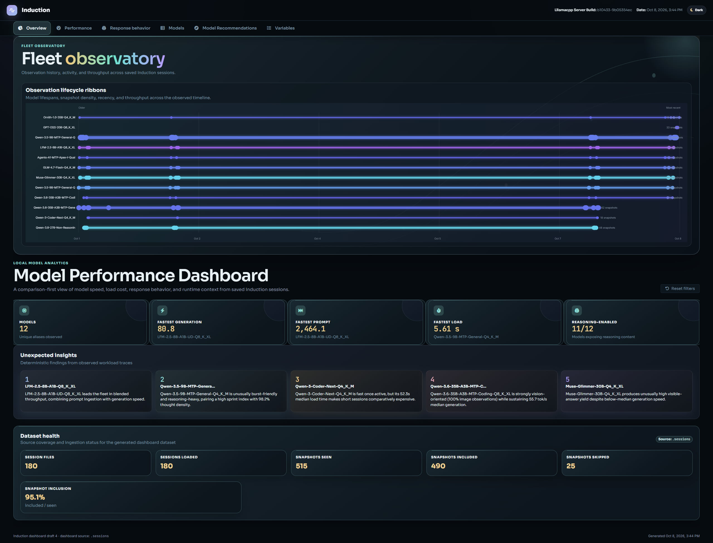
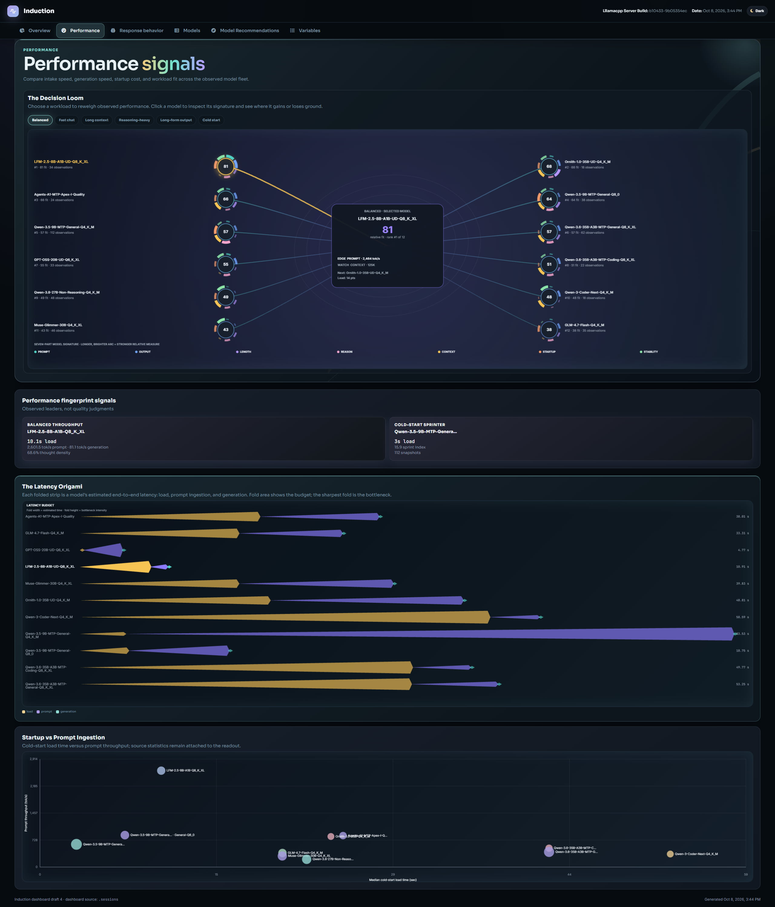
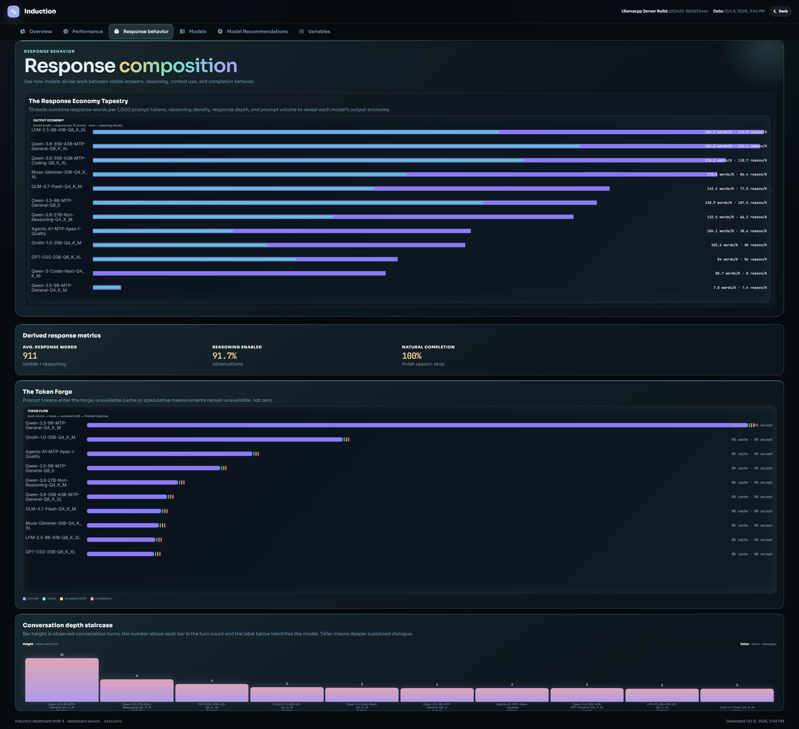
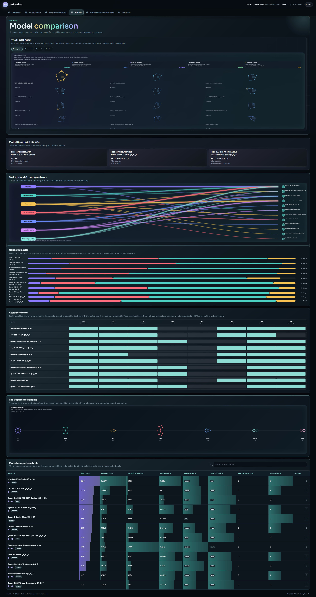
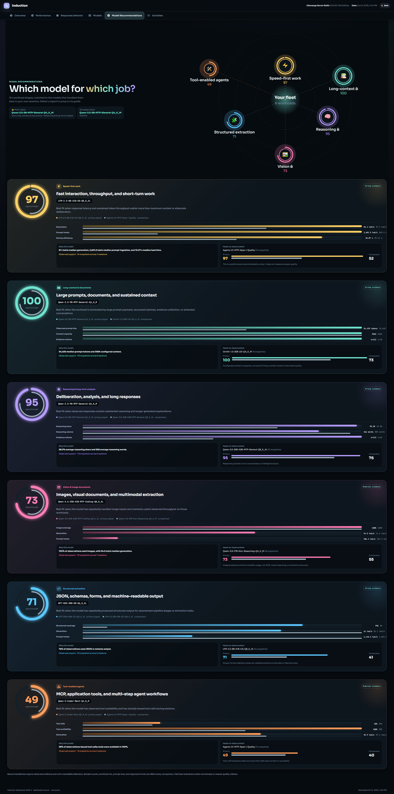

# Dashboard metrics

Use the dashboard generator when you want a server-free HTML view of telemetry
and responses saved by previous sessions. It reads persisted session data and
does not perform inference.

Generate a server-free metrics projection from saved and unsaved sessions:

```bash
induction dashboard generate
```

The source is `.sessions/`. Outputs are
`data/dashboard/session_metrics.json` and the self-contained
`data/dashboard/dashboard.html`. Raw transcripts, reasoning, responses,
properties, metrics, and slot payloads remain in the session files.

To exclude models from the generated dashboard, create `.dashboardignore` in
the repository root with one exact model ID per line. Blank lines and lines
starting with `#` are ignored. Matching model snapshots and evaluation results
are omitted from both dashboard artifacts. If the file is absent, no models
are excluded.

See the [CLI reference](CLI-REFERENCE.md#server-and-runtime-json-output) for
related command options.

The generated dashboard has six views: **Overview** (fleet history, KPIs,
unexpected insights, and dataset health), **Performance** (Decision Loom,
latency, startup-versus-prompt scatter, and stability), **Response behavior**
(response economy, token forge, and conversation depth), **Models** (Model
Prism, routing, capability matrices, genome, and the precise comparison table),
**Model Recommendations** (a workload-fit routing guide), and **Variables**
(the unchanged telemetry reference).

## Dashboard views

The following captures document the current visual layout and major analytical
surfaces. Dense charts and tables reflow for smaller screens; the Models
routing network is hidden below 767.98px when it cannot remain legible.

### Overview



Overview combines the fleet timeline, model performance KPIs, deterministic
insights, and dataset health metrics.

### Performance



Performance contains the Decision Loom, latency comparison, startup-versus-
prompt analysis, and supporting performance fingerprints.

### Response behavior



Response behavior shows response economy, token flow, derived response metrics,
and conversation-depth behavior. The former Weather System and Conversation
Spiral panels are no longer part of this view.

### Models



Models provides the Model Prism, model fingerprints, task-to-model routing,
capacity and capability matrices, the Capability Genome, and the detailed
comparison table. The routing network is intentionally omitted at narrow mobile
widths when its labels and connections would not remain readable.

### Model Recommendations



Model Recommendations consolidates observed telemetry into six workload
buckets: speed-first work, long-context and documents, reasoning and long-form
analysis, vision and image documents, structured extraction, and tool-enabled
agents. Each recommendation card includes the selected model, signal strength,
supporting metrics, and comparison context.

Fingerprint insights are derived from the same saved observations and now live
in Overview, Performance, and Models. Startup vs Prompt is in Performance;
there is no standalone Fingerprints or Experimental 01 destination. Legacy
`#fingerprints` and `#experimental-01` hashes redirect to `#models`.

Fingerprint values, selection routes, and compound metrics are workload
observations and heuristics rather than controlled benchmarks or task-accuracy
evaluations. Missing telemetry is omitted from calculations; absence is not
zero. Models with fewer than five snapshots are marked as small-sample results,
and comparisons with at least ten snapshots receive the high-sample label. The
model search field filters the comparison and related insight cards.

The default **Midnight Signal Lab** theme has a persisted dark/light toggle,
responsive contained scrolling for dense tables and matrices, keyboard-aware
chart controls, inline SVG motifs, and reduced-motion support. Chart colors
retain their metric meaning; view accent colors are atmospheric only. Model
details remain available from the comparison table, while Variables preserves
its direct/inferred fields and behavior.
